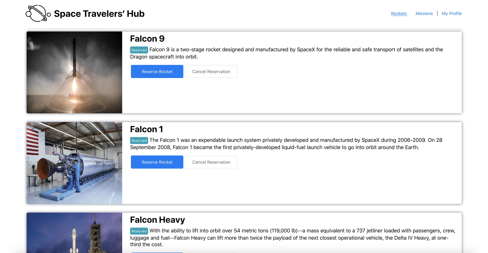

# Space Traveler



> Placeholder for project description


Additional description about the project and its features.

## Built With

- Major languages (HTML, CSS, JavaScript)

- Frameworks / Libraries
  ```bash
  - React Library
  - other libraries will go here
  ```

- Technologies used 
  
  ``` bash
  - Git(version control)
  ```


## Getting Started

To get a local copy up and running follow these simple example steps.

### Prerequisites
 - A text editor(preferably Visual Studio Code)

### Install
  -  [Git](https://git-scm.com/downloads)
  -  [Node](https://nodejs.org/en/download/)

### Usage
#### Clone this repository

```bash
$ git@github.com:clintonjosephs/Space-traveler.git
$ cd Space-traveler
```
#### Run project

```bash
$ npm install
$ npm build
$ npm start
```

#### Open page in browser
```bash
$ runs on http://localhost:3001/
```

## Authors

👤 **Clinton Mbonu**

- GitHub: [@clintonjosephs](https://github.com/clintonjosephs)
- LinkedIn: [LinkedIn](https://linkedin.com/in/clinton-mbonu)

👤 **Pedro Guerreiro**

- GitHub: [@guerreiropedr0](https://github.com/guerreiropedr0)
- Twitter: [@guerreiropedr0](https://twitter.com/guerreiropedr0)
- LinkedIn: [Pedro Guerreiro](https://www.linkedin.com/in/guerreiropedr0/)

## 🤝 Contributing

Contributions, issues, and feature requests are welcome!

Feel free to check the [issues page](https://github.com/clintonjosephs/BookStore/issues).

## Show your support

Give a ⭐️ if you like this project!

## 📝 License

This project is [MIT](https://opensource.org/licenses/MIT) licensed.